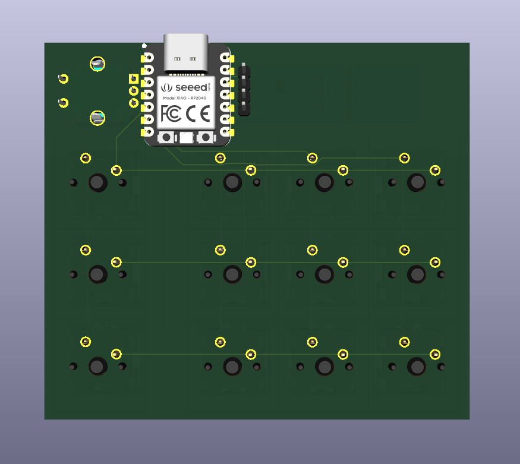

# Macropad - Slickopad

*A fully custom 12 key macropad with a small oled panel and a rotary encoder!*

## Gallery  

### **PCB & Electronics**  
| Schematic | PCB | Assembled (front)| Assembled (back |  
|-----------|-----|-----------|----------------| 
|  |  |  |   |  

### **Case Components**  
| Top Case (Angle 1) | Top Case ( Angle 2) | Bottom Case (Angle 1) | Bottom Case (Angle 2) | Plate |  
|------------------|--------------------|-------------|-------| --------|
|  |  |  |  |  |  

### **Assembly**  

This was my first somewhat complex pcb build along with my first time using CAD. 

I've not made (gpt'd) the firmware completely and ill set it up completely when the macropad is physically present.

## Features 
- 8 degree incline
- Oled panel
- Rotary encoder for volume/brightness/etc
- 3 function layers (the 3 right keys)

PS: i had to compromise on the switching functionality of the RE because i couldnt accomodate the its pins due to insufficient gpio pins in the MCU.  didnt want to compromise the design and decided to go ahead with this.

## Design  
- White case
- Black plate
- Black keycaps
- Black knob
  
## Dimensions
- Top plate: **7mm**
- Plate: **1.5mm**
- Base: **13.5mm**
- Inclination bottom block: max height **14mm**

- Total height (main body): **21mm**
- Total height (max): **36mm**

---

### Materials  
| Component | Qty |  
|-----------|-----|  
| DSA keycaps | 12x |  
| MX switches | 12x |    
| XIAO RP2040 | 1x |  
| M3×16 bolts | 4x |  
| EC11 encoder | 1x |
| Oled panel-SSD1306 (0.91') | 1x|
| Knob | 1x |  
| PCB | 1x |
| Case | 1x |

---

> **Note:** Print case parts in white; PCB must be black.
